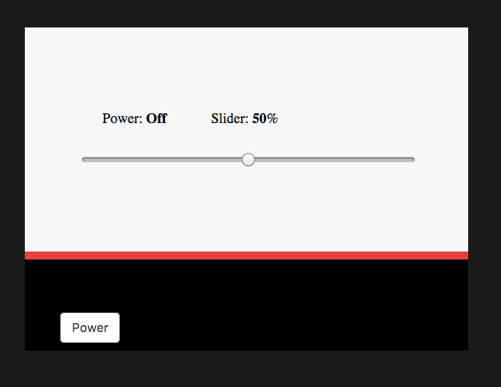

# Cascading Style Sheets (CSS)

CSS is used for styling web pages. Styling can be done in HTML, however it is much more efficient, and the standard, to style via CSS. Here's an example of a basic CSS style for the HTML tag, such as `h1` (which stands for the largest heading):

```css
h1 {
    color: red;
}
```

This would change all your HTML h1 tags (which would look like this: `<h1>some text</h1>`) to have red text.

Now that we have the basic document in place that defines the structure of what our site is doing.   Let's make our page look presentable.

We can create the `site.css` file that will contain all of our style's declarations in the `css` sub-directory.

```
$cloud sudo touch connected-devices/Web/static/test/css/site.css
```

>`touch` is a Unix command that updates the modificationtimestamp on a file to the current time; it has a handy side-effect of creating the specified file if it does not already exist, with zero size.

Open **connected-devices/Web/static/test/css/site.css**.

```css
html, body {
  width: 100%;
  height: 100%;
  background-color: #1A1A1A;
}

body {
  display: flex;
}

main {
  min-height: 200px;
  min-width: 200px;
  max-height: 375px;
  max-width: 500px;
  width: 100%;
  height: 100%;
  display: flex;
  flex-direction: column;
  margin: auto;
}

.labels {
  background-color: #F7F7F7;
  flex: 1 2;
  display: flex;
  justify-content: space-evenly;
  align-items: center;
}

.sliders {
  background-color: #F7F7F7;
  flex: 2 1;
  display: flex;
  flex-direction: column;
  align-items: center;
}

.slider {
  width: 75%;
}

.colorbox {
  background-color: #FF0000;
  height: 2.5%;
}

.buttons {
  background-color: #000000;
  padding: 30px 0 20px 30px;
}

.labels div span {
  font-weight: bold;
}

.btn {
  padding: 6px 12px;
  font-size: 14px;
  font-weight: 400;
  line-height: 1.5;
  text-align: center;
  cursor: pointer;
  border: 1px solid transparent;
  border-radius: 4px;
}

.btn-default {
  color: #333;
  background-color: #fff;
  border-color: #ccc;
}

.btn-default:hover {
  background-color: #ebebeb;
}
```

Save and close this document.  We can now tell the html file to use this style sheet. Open **connected-devices/Web/static/test/test.html**.  Add the following line to the document's header:

```html
<head>

  ...

  <link rel="stylesheet" type="text/css" href="/test/css/site.css">

</head>
```

Save and close this document and refresh your page.   You will see something like this:



## CSS Selectors

[CSS Selectors](https://www.w3schools.com/cssref/css_selectors.asp) are patterns that are used to select the HTML element or elements that you want to style.  By selecting HTML elements with a CSS Selector, you can apply style properties to the selected element.

Two very common selectors illustrated in the **connected-devices/Web/static/test/css/site.css** above are:

* ._class_ (e.g., `.slider`) applies the properties to all instances of the specified class (elements which have `slider` class specified in this case)
* \#\[_id_\] (e.g., `#power`) applies the properties to the particular element that has a matching ID (e.g., the HTML button element).

### CSS references

If you would like to learn more about CSS, check out:

* [W3C (the maintainer of both HTML and CSS standards)](https://www.w3.org) maintains an excellent educaiton site, including info on CSS, at [W3CSchool](http://www.w3schools.com/css/css_examples.asp)
* [Mozilla CSS Developer Tools](https://developer.mozilla.org/en-US/docs/Web/Guide/CSS/Getting_started)
* [CSS Tricks](https://css-tricks.com/)

Next up: go to [Introduction to Javascript](../05.4_Introduction_to_JavaScript/README.md)

&copy; 2015-2025 LeanDog, Inc. and Nick Barendt
