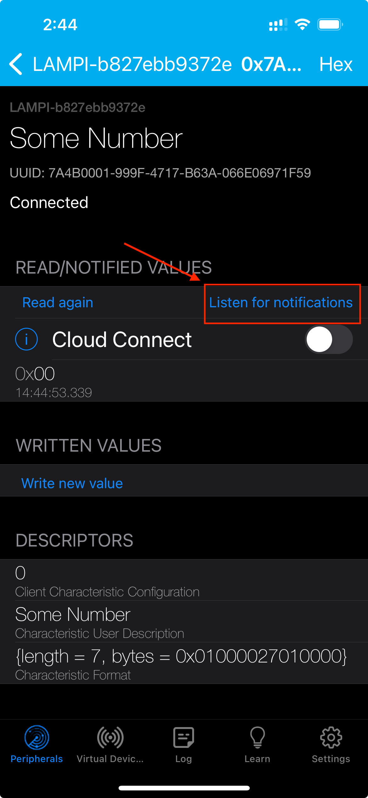

# Supporting Notify on GATT Characteristics

So we can now can create a Service with Characteristics, and the ability to read and write (modify) a non-constant (mutable) Characteristic value.  If the Characteristic represent a sensor, say a temperature reading, a Client of the service can monitor the temperature by repeatedly reading the Characteristic - this is known as polling.  While polling is a perfectly acceptable way to monitor something, it can become a performance bottleneck.  For battery-powered devices, it can also become a battery-killer.

The GATT model is analogous to reading and writing memory.  Polling (repeatedly reading) a memory location can also become a performance bottleneck.  In the hardware world, the standard solution is an interrupt - an asynchronous notification that an event of interest has occurred - typically that a new value is ready.  The BLE equivalent of an interrupt is Notify or Indicate.

Many BLE GATT interactions are synchronous - the Client (Central) makes a request of the Server (Peripheral), and the Server responds.  BLE has two asynchronous mechanisms - Notify and Indicate, though, that are Server initiated.  

Indications are the same as Notifications, but the Server requires the Client to Acknowledge the updated value (whereas Notifications are equivalent to "fire-and-forget" or QoS 0 in MQTT).

Both Indications and Notifications rely on the Characteristic providing the **Client Characteristic Configuration** (see section 3.3.3.3 of of the [Core Blueooth Specification](https://www.bluetooth.com/specifications/specs/core-specification-5-1/).  This to let Client know the behaviors supported for a particular Characteristic, and then the Client (Central) can modify the Descriptor (with a write) to inform the Server that it should enable Notifications and/or Indications for the Characteristic (note, unlike the Descriptors we have seen so far, which have been read-only, this Descriptor is Client writable).

A Client can enable Notifications; when enabled, the Server will automatically send new values for the Characteristic to the Client when the value changes.  Our `pybleno` library handls most of the details, but we need to include the `notify` property on our Characteristic and provide a mechanism to update the Client (Central) when the Characteristic's value changes.

## Adding Notify to our NumberCharacteristic

Here is an updated version of `number_service.py`:

```python
from pybleno import BlenoPrimaryService, Characteristic, Descriptor
from number_state import NumberState
import struct


class NumberCharacteristic(Characteristic):
    def __init__(self, number_state):
        Characteristic.__init__(self, {
            'uuid': '7a4b0001-999f-4717-b63a-066e06971f59',
            'properties': ['read', 'write', 'notify'],
            'value': None,
            'descriptors': [
                Descriptor({
                    'uuid': '2901',
                    'value': bytes("Some Number", 'utf-8')
                }),
                Descriptor({
                    'uuid': '2904',
                    # Presentation Format fields are:
                    # Format      1 octet :  0x04 - unsigned 8-bit integer
                    # Exponent    1 octet :  0x00
                    # Unit        2 octets:  0x2700 - unitless
                    # Name Space  1 octet :  0x01 - Bluetooth SIG
                    # Description 2 octets:  0x0000 - blank
                    'value': struct.pack("<BBHBH", 0x01, 0x00,
                                         0x2700, 0x01, 0x0000)
                })

            ]
        })
        self.number_state = number_state
        self.updateValueCallback = None
        self.number_state.on('numberChange', self.handle_number_change)

    def _encode_some_number(self):
        return struct.pack("<B", self.number_state.number)

    def onReadRequest(self, offset, callback):
        if offset:
            callback(Characteristic.RESULT_ATTR_NOT_LONG, None)
        else:
            data = self._encode_some_number()
            callback(Characteristic.RESULT_SUCCESS, data)

    def onWriteRequest(self, data, offset, withoutResponse, callback):
        if offset:
            callback(Characteristic.RESULT_ATTR_NOT_LONG)
        elif len(data) != 1:
            callback(Characteristic.RESULT_INVALID_ATTRIBUTE_LENGTH)
        else:
            print(f'Writing SomeNumber {data}')
            self.number_state.number = struct.unpack("<B", data)[0]
            callback(Characteristic.RESULT_SUCCESS)

    def handle_number_change(self, newValue):
        print("Handling SomeNumber change")
        if self.updateValueCallback:
            data = self._encode_some_number()
            self.updateValueCallback(data)


class SomeNumberService(BlenoPrimaryService):
    uuid = '7a4bbfe6-999f-4717-b63a-066e06971f59'

    def __init__(self):
        self.number_state = NumberState()

        BlenoPrimaryService.__init__(self, {
            'uuid': self.uuid,
            'characteristics': [
                NumberCharacteristic(self.number_state)
            ]
        })
```

We have made a few changes:

1. We have added `'notify'` to the `properties` of 'NumberCharacteristic'.  (Note: `pybleno` will automatically add the **Client Characteristic Configuration]** Descriptor and allow Clients to enable/disable Notifications if the `'notify'` property is present on a Characteristic.)
2. We have registered an event handler with the `NumberState` object for the event `numberChange`; when that event is emitted, our event handler `handle_number_change()` will be called
3. We have added the `handle_number_change` method - when it is called, it will check to see if the `updateValueCallback` is non-None - if so, it wiii call the `updateValueCallback` with the encoded value

When a client enables notification on a Characteristic, `pybleno` will assign update the `updateValueCallback` with a function; when a client cancels notifications, `updateValueCallback` is set to None again by `pybleno`.

Run the application.

You will see a new option on the 'Some Number` Characteristic "Listen for notifications":



We will add some dynamic behavior next, with bi-directional MQTT Integration

Next up: [09.5 MQTT Integration](../09.5_MQTT_Integration/README.md)

&copy; 2015-2025 LeanDog, Inc. and Nick Barendt
